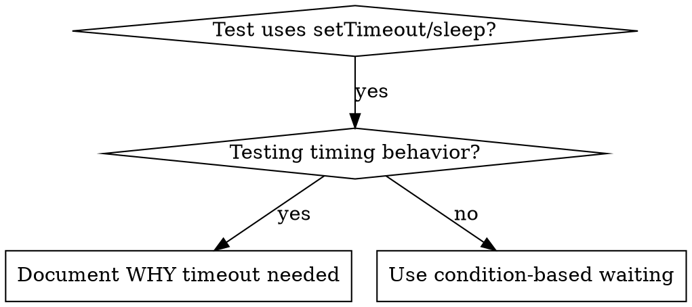

# Condition-Based Waiting

## Overview

Flaky tests often guess at timing with arbitrary delays. This creates race conditions where tests pass on fast machines but fail under load or in CI.

**Core principle:** Wait for the actual condition you care about, not a guess about how long it takes.

## When to Use



**Use when:**
- Tests have arbitrary delays (`setTimeout`, `sleep`, `time.sleep()`)
- Tests are flaky (pass sometimes, fail under load)
- Tests timeout when run in parallel
- Waiting for async operations to complete

**Don't use when:**
- Testing actual timing behavior (debounce, throttle intervals)
- Always document WHY if using arbitrary timeout

## Core Pattern

```go
// ❌ BEFORE: Guessing at timing
time.Sleep(50 * time.Millisecond)
result := getResult()
assert(result != nil)

// ✅ AFTER: Waiting for condition
waitFor(func() bool { return getResult() != nil }, "result ready", 5*time.Second)
result := getResult()
assert(result != nil)
```

## Quick Patterns

| Scenario | Pattern |
|----------|---------|
| Wait for event | `waitFor(func() bool { return findEvent(events, "DONE") != nil })` |
| Wait for state | `waitFor(func() bool { return machine.State == "ready" })` |
| Wait for count | `waitFor(func() bool { return len(items) >= 5 })` |
| Wait for file | `waitFor(func() bool { _, err := os.Stat(path); return err == nil })` |
| Complex condition | `waitFor(func() bool { return obj.Ready && obj.Value > 10 })` |

## Implementation

Generic polling function:
```go
func waitFor(condition func() bool, description string, timeout time.Duration) error {
	ctx, cancel := context.WithTimeout(context.Background(), timeout)
	defer cancel()

	ticker := time.NewTicker(10 * time.Millisecond) // Poll every 10ms
	defer ticker.Stop()

	for {
		if condition() {
			return nil
		}
		select {
		case <-ctx.Done():
			return fmt.Errorf("timeout waiting for %s after %v", description, timeout)
		case <-ticker.C:
		}
	}
}
```

See `condition-based-waiting-example.go` in this directory for complete implementation with domain-specific helpers (`WaitForEvent`, `WaitForEventCount`, `WaitForEventMatch`) from actual debugging session.

## Common Mistakes

**❌ Polling too fast:** `setTimeout(check, 1)` - wastes CPU
**✅ Fix:** Poll every 10ms

**❌ No timeout:** Loop forever if condition never met
**✅ Fix:** Always include timeout with clear error

**❌ Stale data:** Cache state before loop
**✅ Fix:** Call getter inside loop for fresh data

## When Arbitrary Timeout IS Correct

```go
// Tool ticks every 100ms - need 2 ticks to verify partial output
WaitForEvent(ctx, source, threadID, "TOOL_STARTED", 5*time.Second) // First: wait for condition
time.Sleep(200 * time.Millisecond)                                  // Then: wait for timed behavior
// 200ms = 2 ticks at 100ms intervals - documented and justified
```

**Requirements:**
1. First wait for triggering condition
2. Based on known timing (not guessing)
3. Comment explaining WHY

## Real-World Impact

From debugging session (2025-10-03):
- Fixed 15 flaky tests across 3 files
- Pass rate: 60% → 100%
- Execution time: 40% faster
- No more race conditions
